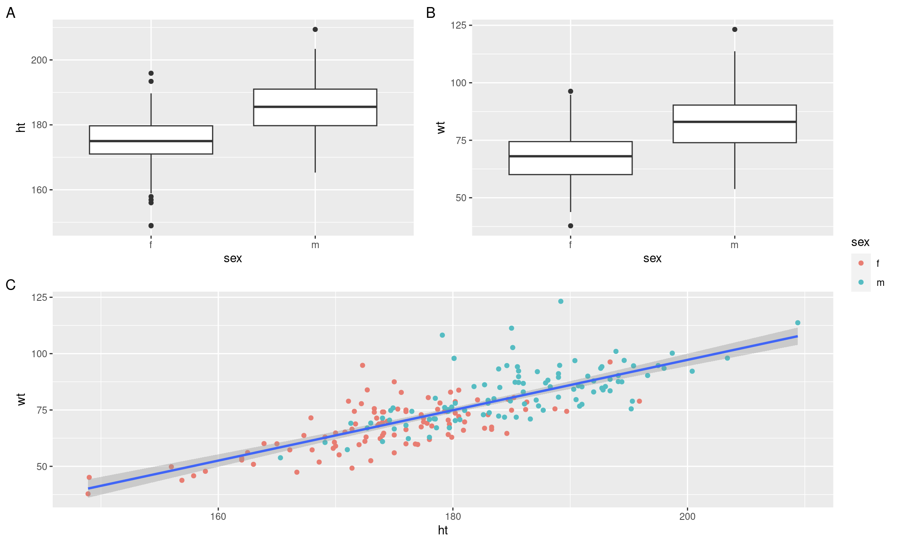

# Reporting your analysis - Workshop 6 - Athletes continued, Week 6B

This semester we have been working through the complete process of analysing a data set. So we not only do we need to be working on our analytical skills but also thinking about how we report our analyses. Over the last few weeks we have been conducting analysis that will eventually be put into a mock report (to help you prepare for future reports that you may need to produce). So lets begin by thinking about how we might present some of our figures.  

## Selecting what to report

When you are conducting your analysis you will produce many plots, however you will not necessarily need to present all of these plots. Some analyses you perform as part of your data exploration and will not be used in the final write up. Being good at selecting what to report is quite an undervalued skill. 

### Task 1 - Start thinking about how you might report your data

First of all, identify which plots you would include in a report, if you were interested in answering the following questions;

* Is there a difference between male and female athlete height?
* Is there a difference between male and female athlete weight?
* Is there a difference between male and female athlete red blood cell count?
* Is there a relationship between height and weight in male and female athletes?
* Is there a relationship between red blood cell count and weight in male and female athletes?

> **Selecting plots for a report**
> An extremely common error students make is to include every plot they build in their report. Sometimes it is important to build a plot, as part of your own data exploration, but not include it when writing your report. Histograms are a prime example of this, unless the question you are exploring is related to data distribution, you do not need to include histograms in your project reports. You do need to know how the data are distributed, but you do not need to present the histograms that show the data distribution. Your report should only include figures that relate to the questions you are asking. You want to try and tell a story through your figures, while showing academic rigour. With this in mind, which of your plots would you include in your report, given the questions above?  

<details><summary> **Click-me to see which figures Ellen would present** </summary>

There are several combinations of plots you could present to answer the above questions in a report, but this is how I would do it;

* Figure 1 - A multi-panel (group of plots) figure containing box plots for (i) weight in male and female athletes, (ii) height in male and female athletes and (iii) scatter plot for weight vs height in male and female athletes (pooled)
* Figure 2 - a multi-panel figure containing (i) box plot for red blood cell count in male and female athletes, (ii) scatter plot for red blood cell counts in male athletes, (iii) scatter plot for red blood cell counts in female athletes

We will cover how to make multi-panel figures shortly. 
</details>
<br />
Make each figure that you would include in your report visually pleasing. Use your ggplot skills and scripts to do this. Think about colour choices and try to make them uniform.

### Task 2 - Building your first multi-pannel figure

Above I suggested that it may be a good idea to present some of your reported plots in a multi-panel figure. We can make these in R using the package `patchwork`. See if you can install and load the `patchwork` package and then take a look at the the chunk below for a demonstration of how it can be used;

```{r}
# Demonstrating how to use the plot_layout function within the patchwork package to make multi-panel figures
# First, here are some basic plots, you can use your own plots that have been nicely formatted instead, these are just to demonstrate
weight_box <- ggplot(data = athletes,aes(x = sex, y = wt)) + 
  geom_boxplot() 
height_box <- ggplot(data = athletes,aes(x = sex, y = ht)) + 
  geom_boxplot() 
height_v_weight <- ggplot(data = athletes,aes(x = ht, y = wt)) + 
  geom_point(aes(colour = sex)) +
  geom_smooth(method="lm")

# Now we can use the plot_layout function within the patchwork package to make our multi-panel figure.
# Here I have asked for the height and weight box plots to be on the top row, side by side and the height v weight scatter below.
# You can play with the configuration to suit your tastes, use help(plot_layout) to see some other configurations.
# You may notice that here I have specified the package for the function using "::" e.g. patchwork::plot_layout.
# This is because some functions across multiple packages have shared names, as the do here, so R can become confused, by specifying the package, I am directing R to the specific package which contains the specific function I wish to use. 
# The second argument (guides='collect') pulls together all the little figure keys you may have and presents them on one place and should remove duplicated information.
# The final argument adds a tag onto each plot within the figure, in this case A, B C, this makes it easier to write about each plot when you construct your figure legend.
(height_box | weight_box) / height_v_weight + 
  patchwork::plot_layout(guides ='collect') +
  plot_annotation(tag_levels = 'A')
```

The results of this chunk can be seen in Figure 13.1. Note that these are rough draft figures and placement, you can play with the ggplot and patchwork parameters to get them to look as you would like, and as would be expected in a written report. 

```{r, eval=TRUE, echo=FALSE, out.width="90%", fig.alt= "Results from the patchwork demonstration chunk", fig.cap ="Results from the patchwork demonstration chunk"}

```

Have a go at putting some of your report ready plots into a multi-panel figure. Use `ggsave` to save all of the figures (multi-panel or single-panel). Check your pdf sizes to make sure they are scaled sensibly, you can change the scaling options by looking at the code chunks in **Chapter 12**. You can download these pdfs by opening them in browser and clicking the download button in the top right hand corner. 

## Writing about your analysis 

We have done a lot of exploration when it comes to presenting data and performing analysis. But something you will frequently be asked to do throughout your degree, is write about your findings. Here I will cover a few summary point to bare in mind when writing about your analyses. 

* Keep it concise - always aim to keep sentences short and snappy when writing in the sciences
* Be specific - make sure it is very clear what it is you are discussing, especially when you have a project with multiple variables
* Keep it biology focused - statistics, be they inferential or descriptive, are helpful when building an argument, you can use them to support your point, but the point should be biology driven. 
* **Always** give a measure of spread, like standard error, when discussing a mean.

**Do** this; <br />

“Male gorillas ate fewer bananas per day (mean ± s.e. = 12.3 ± 1.3) compared to females (mean ± s.e. = 14.7 ± 1.1)” <br />

**Do NOT** do this; <br />

"The mean was 12.3 for males and 14.7 for females so females ate more bananas." <br />

This second example makes the entire sentence about the mean values and not about the biological question, which is the difference in bananas eaten by male and female gorillas. It also lacks details like standard deviation or error but discusses a mean which by itself is not very meaningful. The first example was a much more professional and scientifically sound way to report this analysis, using values from the analysis to support the main argument. It will take practice to introduce this writing method into your own work. <br />

You may have noticed that in papers and published reports statistics are reported in a very specific way. When reporting statistics, you should try to state what is shown and then include supporting information, in brackets, from the statistical analysis you have run. When reporting statitics, you should report;

* The statistical test used (e.g. T-test, ANOVA, etc)
* The test statistic (T value or F value for T-tests or ANOVA)
* Degrees of freedom or some alternative indicator of sample size as recomended by the test run
* p value 

For example,  <br />

**Do** this; <br />

“Male gorillas ate fewer bananas per day (mean ± s.e. = 12.3 ± 1.3) compared to females (mean ± s.e. = 14.7 ± 1.1) and this difference was significant (T-test, t = -3.7, d.f. = 99, P = 0.035)"

**Do NOT** do this; <br />

"The mean was 12.3 for males and 14.7 for females so females ate more bananas. The test was significant because p< 0.05" <br />

This second example is very commonly seen in student work and should be avoided at all costs. The analyst here is asking the reader to accept that there was a statistical difference because p was less than an the arbitrary cut off of 0.05. It gives no evidence to show that this is true. It also creates the impression that the person who conducted the analysis had no understanding of how or why they were analysing the data or what it was they were looking for. The first example is only fractionally longer, but provides much more information to the reader, it is professional and allows the reader to feel confident that the analyst is basing their conclusion on sound scientific and statistical evidence. 

### Task 3 - Writing a figure legend 

You will often need to construct figure legends, here are a few pointers to bare in mind;

* Table legends go above and figure legends go below

Legends **should**; 

* Allow the reader to understand the figure without reference to the text, so include information about what is being shown. For example, with a box plot you may wish to say "The middle line, box and whiskers represent the median, interquartile range and range, respectively."
* Include info on sample size, study organism (in Latin) and (if relevant, e.g. ecology) study location and time

Legends **should NOT**;

* Include information that is obvious to a scientific audience (e.g. “a scatter plot to show” or “a graph to show”)
* Repeat what’s in the figure (e.g. describe what the colour mean if you also have a key in the figure)

With this in mind have a go at writing a figure legend for some of the report ready figures that you made earlier. 

### Task 4 - Have a go at preparing a result section

You have some report ready figures and some report ready figure legends now. The next step is to put this together into a result section. Have a think about how you would describe the data you are presenting. It only needs to be a couple of paragraphs. Have a demonstrator check your work. 

## Wrapping up

This is the final content driven Data Sciences workshop. This term we have been slowly progressing through the complete workflow of the analysis of a small data set. We started by importing, checking and cleaning our data, we then did some data exploration and made some exploratory plots before using descriptive and inferential statistics to investigate differences and relationships in more depth. Finally, today, we have looked at the processes of selecting and preparing plots for presentation and how to write about our findings. The next chapter contains the Data Sciences portion of the Skills for Biologists portfolio task, which is the summative assignment for this term. There is one more workshop which is a drop in session, you can get help on your code at this session, but we cannot help with other aspects of your assignment. 

## Before you leave!

Log out of posit Cloud and make sure you save your script!

## References

Pedersen, T. L. (2020). Patchwork: The composer of plots. https://CRAN.R-project.org/package=patchwork
Telford, R.D. and Cunningham, R.B. 1991. Sex, sport and body-size dependency of hematology in highly trained athletes. Medicine and Science in Sports and Exercise 23: 788-794. Pedersen, T. L. (2020). Patchwork: The composer of plots. https://CRAN.R-project.org/package=patchwork <br />
Telford, R.D. and Cunningham, R.B. 1991. Sex, sport and body-size dependency of hematology in highly trained athletes. Medicine and Science in Sports and Exercise 23: 788-794. <br />
Wickham, Hadley, Mara Averick, Jennifer Bryan, Winston Chang, Lucy D’Agostino McGowan, Romain François, Garrett Grolemund, et al. 2019. “Welcome to the tidyverse.” Journal of Open Source Software 4 (43): 1686. https://doi.org/10.21105/joss.01686. <br />
Wickham, Hadley, Winston Chang, Lionel Henry, Thomas Lin Pedersen, Kohske Takahashi, Claus Wilke, Kara Woo, Hiroaki Yutani, and Dewey Dunnington. 2021. Ggplot2: Create Elegant Data Visualisations Using the Grammar of Graphics. https://CRAN.R-project.org/package=ggplot2.
