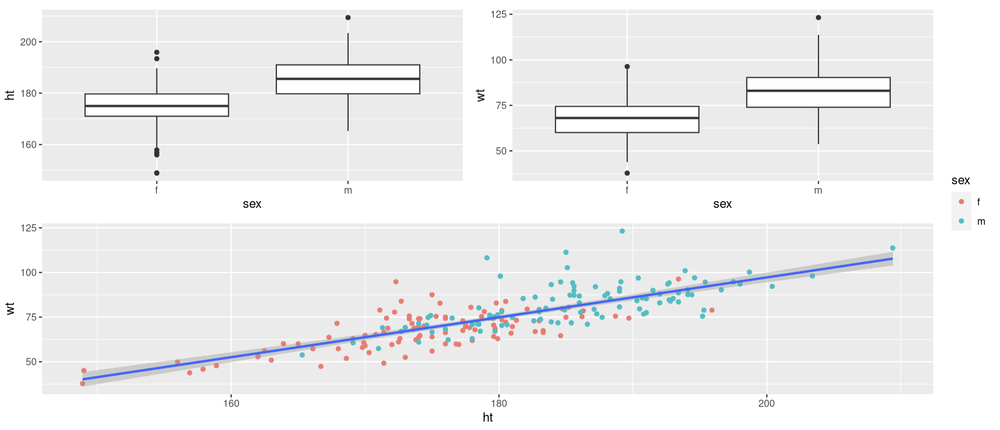

# Reporting your analysis - Workshop 6 - Athletes continued, Week 6B

## Reporting your analysis

This semester we have been working through the complete process of analysing a data set. So we not only do we need to be working on our analytical skills but also thinking about how we report our analyses. Over the last few weeks we have been conducting analysis that will eventually be put into a mock report (to help you prepare for future reports that you may need to produce). So lets begin by thinking about how we might present some of our figures.  

### Task 1 - Start thinking about how you might report your data

First of all, identify which plots you would include in a report if you were interested in answering the following questions;

* Is there a difference between male and female athlete height?
* Is there a difference between male and female athlete weight?
* Is there a difference between male and female athlete red blood cell count?
* Is there a relationship between height and weight in male and female athletes?
* Is there a relationship between red blood cell count and weight in male and female athletes?

> **Selecting plots for a report**
> An extremely common error students make is to include every plot they build in a report. Sometimes it is important to build a plot, as part of your own data exploration, but not include it when writing your report. Histograms are a prime example of this, unless the question you are exploring is related to data distribution, you do not need to include histograms in your project reports. You do need to know how the data are distributed, but you do not need to present the histograms that show the data distribution. Your report should only include figures that relate to the questions you are asking. You want to try and tell a story through your figures, while showing academic rigour. With this in mind, which of your plots would you include in your report, given the questions above?  

<details><summary> **Click-me to see which figures Ellen would present** </summary>

There are several combinations of plots you could present to answer the above questions in a report, but this is how I would do it;

* Figure 1 - A multi-panel (group of plots) figure containing box plots for (i) weight in male and female athletes, (ii) height in male and female athletes and (iii) scatter plot for weight vs height in male and female athletes (pooled)
* Figure 2 - a multi-panel figure containing (i) box plot for red blood cell count in male and female athletes, (ii) scatter plot for red blood cell counts in male athletes, (iii) scatter plot for red blood cell counts in female athletes

We will cover how to make multi-panel figures shortly. 
</details>

Make each figure that you would include in your report visually pleasing. Use your ggplot skills and scripts to do this. Think about colour choices and try to make them uniform.

### Task 2 - Building your first multi-pannel figure

In **Section 13.3.1** I suggested that it may be a good idea to present some of your reported plots in a multi-panel figure. We can make these in R using the package `patchwork`. See if you can install and load the `patchwork` package and then take a look at the the chunk below for a demonstration of how it can be used;

```{r}
# Demonstrating how to use the plot_layout function within the patchwork package to make multi-panel figures
# First, here are some basic plots, you can use your own plots that have been nicely formatted instead, these are just to demonstrate
weight_box <- ggplot(data = athletes,aes(x = sex, y = wt)) + 
  geom_boxplot() 
height_box <- ggplot(data = athletes,aes(x = sex, y = ht)) + 
  geom_boxplot() 
height_v_weight <- ggplot(data = athletes,aes(x = ht, y = wt)) + 
  geom_point(aes(colour = sex)) +
  geom_smooth(method="lm")

# Now we can use the plot_layout function within the patchwork package to make our multi-panel figure.
# Here I have asked for the height and weight box plots to be on the top row, side by side and the height v weight scatter below.
# You can play with the configuration to suit your tastes, use help(plot_layout) to see some other configurations.
# You may notice that here I have specified the package for the function using "::" e.g. patchwork::plot_layout.
# This is because some functions across multiple packages have shared names, as the do here, so R can become confused, by specifying the package, I am directing R to the specific package which contains the specific function I wish to use. 
# The final argument (guides='collect') pulls together all the little figure keys you may have and presents them on one place and should remove duplicated information
(height_box | weight_box) / height_v_weight + patchwork::plot_layout(guides ='collect')
```

The results of this chunk can be seen in Figure 13.1. Note that these are rough draft figures and placement, you can play with the ggplot and patchwork parameters to get them to look as you would like, and as would be expected in a written report. 

```{r, eval=TRUE, echo=FALSE, out.width="90%", fig.alt= "Results from the patchwork demonstration chunk", fig.cap ="Results from the patchwork demonstration chunk"}

```

Have a go at putting some of your report ready plots into a multi-panel figure. Use `ggsave` to save all of the figures (multi-panel or single-panel). Check your pdf sizes to make sure they are scaled sensibly, you can change the scaling options by looking at the code chunks in **Section 12**.

### Task 3 - Writing a figure legend 


## References

Pedersen, T. L. (2020). Patchwork: The composer of plots. https://CRAN.R-project.org/package=patchwork
Telford, R.D. and Cunningham, R.B. 1991. Sex, sport and body-size dependency of hematology in highly trained athletes. Medicine and Science in Sports and Exercise 23: 788-794.
Wickham, Hadley, Mara Averick, Jennifer Bryan, Winston Chang, Lucy D’Agostino McGowan, Romain François, Garrett Grolemund, et al. 2019. “Welcome to the tidyverse.” Journal of Open Source Software 4 (43): 1686. https://doi.org/10.21105/joss.01686.
Wickham, Hadley, Winston Chang, Lionel Henry, Thomas Lin Pedersen, Kohske Takahashi, Claus Wilke, Kara Woo, Hiroaki Yutani, and Dewey Dunnington. 2021. Ggplot2: Create Elegant Data Visualisations Using the Grammar of Graphics. https://CRAN.R-project.org/package=ggplot2.