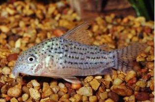

# Portfolio Tasks 

## Background

The data you will be analysing focus' on parasite abundance in *Corydoras* catfish.

```{r, eval=TRUE, echo=FALSE, out.width="90%", fig.alt= "*Corydoras araguaiaensis*", fig.cap ="*Corydoras araguaiaensis*"}

```

*Corydoras* catfishes were collected from Brazil and identified. Each fish belonged to one of two species that are very similar in life history but have dramatically different genome sizes. *Corydoras araguaiaensis* is a polyploid species (probable tetraploid), and *Corydoras maculifer* is a diploid species. The two species are müllerian mimics and coexist, sharing a niche, so environmentally they have had very similar experiences.

This prediction was that polyploid fish may carry a higher number of different immune alleles and therefore may be better able to resist parasites than the diploid species. The fish were dissected and number of parasites found within each individual was counted.

## The data

The data you have been provided with can be found on blackboard. Go to the Data Sets folder in the Data Sciences Learning Module in your Skills module blackboard page, the file is called `catfish_parasite_data.csv`. 

The data consist of four variables;

1) sample - this is simply a sample ID with values ranging from 1-61
2) length_mm - standard length in millimetres. Standard length is a method of measurement for fish and is recorded as the distance from the tip of the snout to the base of the tail. 
3) species - either the polyploid *C. araguaiaensis* (A) or the diploid *C. maculifer* (M)
4) parasite_count - a measure of total parasites counted per individual

This data set was adapted from Bell et al., 2020. 

## The tasks

You will need to produce a series of plots to answer the questions in __Exercise 1__ and present them at publication standard in a multi-panel layout alongised a figure legend. You will then be required to present your script for the second part of this assessment in __Exercise 2__.  

### Exercise 1 - Figure and figure legend
You wish to know if there is a link between genome size and parasite load in *Corydoras* catfishes, but you also want to make sure and show that there are no confounding variables (like size) affecting any conclusions you draw from your analysis. So you ask three questions of your data;

1) Is there a difference in length between *C. araguaiaensis* and *C. maculifer*?
2) Is there a difference in parasite abundance between *C. araguaiaensis* and *C. maculifer*?
3) Is there a relationship between length and parasite abundance in *C. araguaiaensis* and *C. maculifer*?

Set up a new R studio project, import the catfish_parasites data and make sure it is clean and tidy. Complete all the checks that you did in Chapter \@ref(data-setup) and then you can start exploring the data as you did in Chapter \@ref(data-setup) and \@ref(stats). When you are satisfied with the data quality and appearance you can begin to answer the questions above. Construct a plot to address each of these questions. I suggest a plot per question. Make them visually pleasing and then combine the three plots into a multi-panel figure as you did in Chapter \@ref(reporting). Export this as a pdf (see Chapter \@ref(export)). You will be able to download this pdf to your own computer when you are happy with it, instructions on how to do this are in Chapter \@ref(formative). 

Now you will need to copy your figure into a word document and write a suitable figure legend. We have discussed figure legends in lectures and in Chapters \@ref(formative) and \@ref(legend2) we have also explored how to report results in Chapter \@ref(analysis-writing). So now write a clear but concise figure legend underneath your newly made figure. 

### Exercise 2 - Code

As before, during the formative, we require you to upload the script you have created to analyse the `catfish_parasites.csv` dataset. I strongly recommend keeping your script nice and clean and tidy and well commented throughout your `catfish_parasite` analysis and have it saved nicely in your `scripts` folder. If you do then this step will be super easy! You simply need to download your script using the same method described above in Chapter \@ref(formative).

### Submission

If you go to the Data Sciences Learning Module in the BIO-4008Y page of blackboard you will see a link to PebblePad. If you follow this link you should be automatically taken to the Data Sciences portfolio. You will see there are two pages to the portfolio, at this stage you only need to complete the `Summative` page. You will see there are a number of tick boxes to help guide you through what our expectations are from your work here. There are then two places to upload your work, one for your figure and figure legend and the other for your script. Upload the corresponding documents where required. 

You may notice that there is a check box where you will need to assert that this is your own work. Once this is done you can scroll down and you will be able to mark the page as complete. Once you have marked your page as complete you can consider it submitted. 

> Top tip - as you scroll down the page you can see that there is a marking rubric included, these are the criteria under which we will be marking your work, a similar one has been created for the summative page as well. 

Good luck everyone! The final workshop in Week 8 will be a drop in session, so if you are really stuck do feel free to pop by. We can help you with fixing code but cant give you more feedback then that. 

## References

Bell, E., Cable, J., Oliveira, C., Richardson, D., Yant, L. & Taylor, M. (2020); Help or Hindrance? The evolutionary impact of whole-genome duplication on immunogenetic diversity and parasite load. Ecology and Evolution. 10 (24). 13949-13956.

