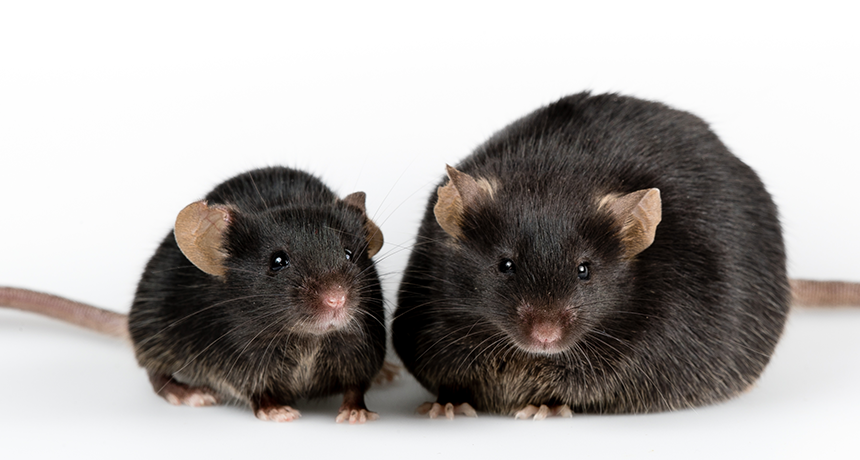

# Summative Tasks 

For this assessment you have a choice of two data sets to work with, **you only need to select one**. If you are more interested in ecology, evolutionary biology or parasitology I recommend the *Corydoras* catfishes data set, if you are more interested in biomedicine, biochemistry or microbiology I recommend the mouse obesity data set. 

Take a look at the background of your chosen data set below.

<details><summary> **Show me the _Corydoras_ catfishes data set background** </summary>

**Background**

The data you will be analysing if you choose this data set focus on parasite abundance in *Corydoras* catfish.

```{r, eval=TRUE, echo=FALSE, out.width="90%", fig.alt= "*Corydoras araguaiaensis*", fig.cap ="*Corydoras araguaiaensis*"}
knitr::include_graphics("figures/cory.jpg")
```

*Corydoras* catfishes were collected from Brazil and identified. Each fish belonged to one of two species that are very similar in life history but have dramatically different genome sizes. *Corydoras araguaiaensis* is a polyploid species (probably tetraploid), and *Corydoras maculifer* is a diploid species. The two species are müllerian mimics and coexist, sharing a niche, so environmentally they have had very similar experiences.

The prediction was that polyploid fish may carry a higher number of different immune alleles and therefore may be better able to resist parasites than the diploid species. The fish were dissected and number of parasites found within each individual was counted.

**_Corydoras_ data**

The data you have been provided with can be found on blackboard. Go to the Data Sets folder in the Data Sciences Learning Module in your Skills module blackboard page, the file is called `catfish_parasite_data.csv`. 

The data consist of four variables;

1) sample - this is simply a sample ID with values ranging from 1-61
2) length_mm - standard length in millimetres. Standard length is a method of measurement for fish and is recorded as the distance from the tip of the snout to the base of the tail. 
3) species - either the polyploid *C. araguaiaensis* (A) or the diploid *C. maculifer* (M)
4) parasite_count - a measure of total parasites counted per individual

This data set was adapted from Bell et al., 2020. 

**_Corydoras_ Questions** 

You wish to know if there is a link between genome size and parasite load in *Corydoras* catfishes, but you also want to make sure and show that there are no confounding variables (like size) affecting any conclusions you draw from your analysis. So you ask three questions of your data;

1) Is there a difference in length between *C. araguaiaensis* and *C. maculifer*?
2) Is there a difference in parasite abundance between *C. araguaiaensis* and *C. maculifer*?
3) Is there a relationship between length and parasite abundance in *C. araguaiaensis* and *C. maculifer*?

</details>


<details><summary> **Show me the mouse obesity data set background** </summary>

**Background** 

The data you will be analysing if you choose this data set focus on microbiota and dietary energy harvest of mice with a mutation that produces obesity. 

```{r, eval=TRUE, echo=FALSE, out.width="90%", fig.alt= "*Corydoras araguaiaensis*", fig.cap ="Wild type vs obese mice"}

```

Mice were grouped into two categories wild type and obese. The wild type mice can be thought of as mice with phenotypic characteristics that are considered "normal" in mouse populations. Obese mice were homozygous for a mutation in the leptin gene, which is known to produce obese phenotypes. However some evidence suggests that differences in weight between wild type and obese mice may not always linked to food consumption but instead to mutualistic bacterial communities living in the gut (gut microbiome).

The prediction here was that if obesity in mice was linked to differences in gut microbiome then the gut microbiome of an obese mouse may be able aid in the breaking down of otherwise indigestible dietary polysaccharides (making those resources digestible to the obese mouse and leading to weight gain). An end product of the microbial breakdown of these normally indigestible polysaccharides is short short chain fatty acid buryrate, so if the gut microbiome was aiding in breakdown of indigestible polysaccharides you might expect higher concentrations of butyrate in the bowel of obese mice and that obese mice faeces might have fewer calories remaining (due to more energy being extracted during digestion). During this experiment both wild type and obese mice were fed standardised amounts of food. 

**Mouse data**

The data you have been provided with can be found on blackboard. Go to the Data Sets folder in the Data Sciences folder in your Skills module blackboard page, the file is called `obese_mouse_data.csv`. 

The data consist of four variables;

1) mouse_id - this is simply a sample ID with values ranging from 1-61
2) genotype - either the wild type (wt) or the obese (ob) mouse genotypes
3) weight_g - weight of each mouse in grams 
4) bomb_kcalg - bomb calorimetry - gross energy measured in per gram of fecal sample - measured in kcal g^-1^
5) butyrate_umolg - gass chromatography mass-spectrometry quantification of the short chain fatty acid butyrate from the large intestine of mice measured in \mu mol per gram wet weight intestine contents. 

This data set was adapted from Turnbaugh et al., 2006.

**Mouse questions**

You wish to know if there is a link between obesity and the gut microbiome of mice, but you also want to make sure and show that there are no confounding variables (like size) affecting any conclusions you draw from your analysis. So you ask three questions of your data;

1) Is there a difference in butyrate concentration between obese and wild type mice?
2) Is there a difference in bomb calorimetry between obese and wild type mice?
3) Is there a relationship between mouse weight and butyrate concentration in obese and wild type mice?

</details>

## The tasks for the summative

You will need to produce a series of plots to answer the questions from your chosen data set (these are in the relavent background sections above) and present them as publication standard in a multi-panel layout alongside a figure legend and some statistical analyses **(Task 1)**. You will then be required to present your script for the second part of this assessment **(Task 2)**.  

### Task 1 - Produce a short result section

Set up a new R studio project, import the data set you have chosen to work with (either catfish_parasite_data.csv **or** mouse_obesity_data.csv) and make sure it is clean and tidy. Complete all the checks that you did in Chapter \@ref(data-setup) and then you can start exploring the data as you did in Chapter \@ref(data-setup) and \@ref(stats). When you are satisfied with the data quality and appearance you can begin to answer the questions above. Construct a plot to address each of these questions posed in the relavent background sections above. I suggest one plot per question. Make them visually pleasing and then combine the three plots into a multi-panel figure as you did in Chapter \@ref(reporting). Export this as a pdf (see Chapter \@ref(export)). You will be able to download this pdf to your own computer when you are happy with it, instructions on how to do this are in Chapter \@ref(formative). 

Now you will need to copy your figure into a word document and write a suitable figure legend. We have discussed figure legends in lectures and in Chapters \@ref(formative) and \@ref(legend2). So now write a clear but concise figure legend underneath your newly made figure. 

Finally write a paragraph describing your findings and including any statistics that you feel relevant to your questions and plots, we have explored how to report results and statistics in Chapter \@ref(analysis-writing) and in lecture 10. Remember when reporting statistics you should make a biologically relevant statement and then in brackets include your statistical support. For differences this means the type of test performed (e.g. t test, ANOVA, etc), the test statistic (t or F most commonly), degrees of freedom and p value. If you have conducted a regression you should report the slope, standard error of the slope, R squared, test statistic (t value), degrees of freedom and p value. Revisit lecture 10 if you are usure. 

### Task 2 - Code

As before, during the formative, we require you to upload the script you have created to analyse your chosen dataset. I strongly recommend keeping your script nice and clean and tidy and well commented throughout your analysis and have it saved nicely in your `scripts` folder. If you do then this step will be super easy! You simply need to download your script using the same method described above in Chapter \@ref(formative). Make sure you dont inadvertently remove the .R suffix on your file name (sometimes opening the downloaded script on a computer without R installed will do this).

### Submission

Go to blackboard and upload **BOTH** your results document and your script. 

Good luck everyone! The final workshop in Week 8 will be a drop in session, so if you are really stuck do feel free to pop by. We can help you with fixing code but cant give you more feedback then that. 

## References

Bell, E., Cable, J., Oliveira, C., Richardson, D., Yant, L. & Taylor, M. (2020); Help or Hindrance? The evolutionary impact of whole-genome duplication on immunogenetic diversity and parasite load. Ecology and Evolution. 10 (24). 13949-13956.

Turnbaugh, P., Ley, R.E., Mahowald, M.A., Magrini, V., Mardis, E.R., Gordon, J.I., (2006). An obesity-associated gut microbiome with increased capacity for energy harvest. Nature. 444 (21/28). 1027 - 1031. 

